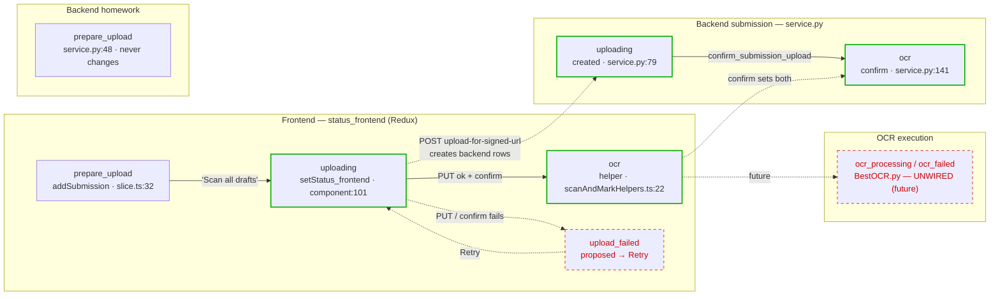
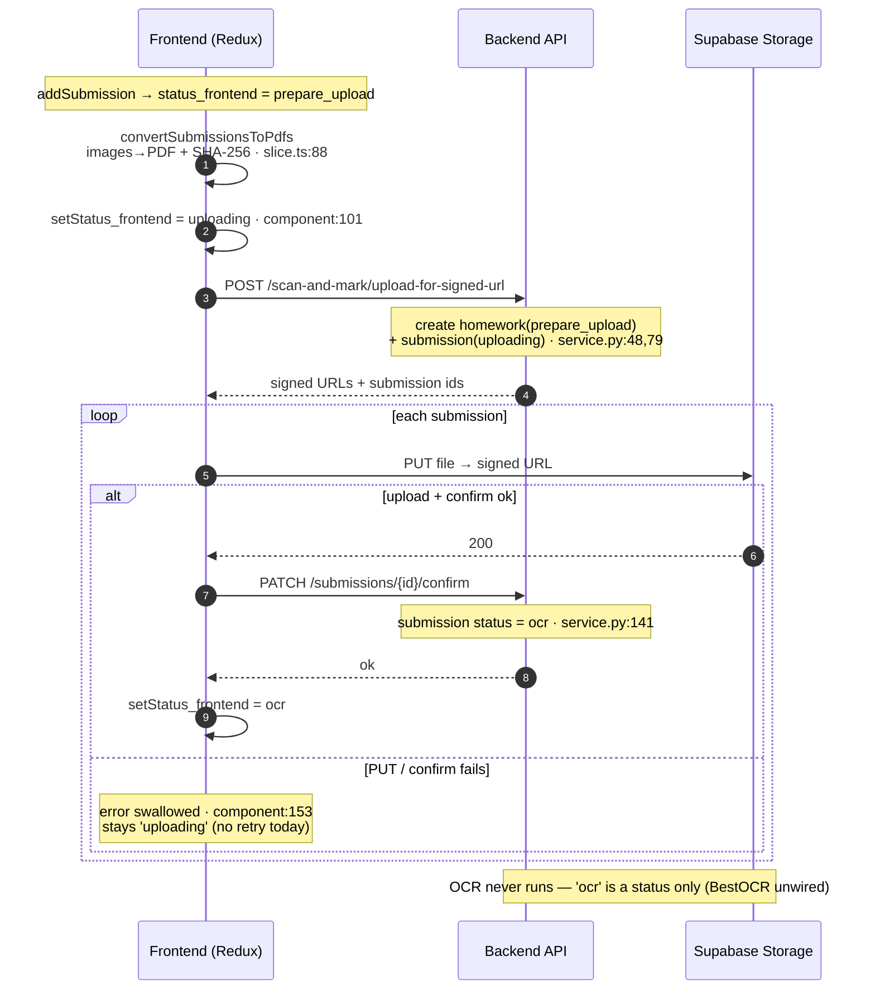

# Scan & Mark — how the states change

How a homework submission moves from "just added" through upload to OCR, across the **frontend
(Redux)** and the **backend (DB)**. The two layers keep **separate status fields** that are set at
different points in the flow.

> Diagrams are embedded inline as **mermaid** (they render automatically on GitHub / GitLab / VS Code —
> no external file needed). An editable draw.io copy also exists:
> [`scan-and-mark-states.drawio`](./scan-and-mark-states.drawio).

---

## The status fields

| Layer | Field | Defined in |
|---|---|---|
| Frontend | `UploadSubmission.status_frontend` | `src/store/slices/ScanAndMark_homeworksubmissions_slice.ts` |
| Frontend | marking-scheme `status_frontend` | `src/store/slices/homeworkCriteria_OnetimeUpload_slice.ts` |
| Backend | `homework.status` | `src/modules/scan_and_mark/scan_and_mark_service.py` |
| Backend | `homework_submission_onetime.status` | `scan_and_mark_service.py` |
| Backend | `marking_scheme.status` | `scan_and_mark_service.py` |

---

## Frontend submission lifecycle (`status_frontend`)

1. **`prepare_upload`** — set in `addSubmission` (`slice.ts:32`) when the teacher adds a submission.
   Client-only; there is no backend record yet. The card shows the **Scan** action in this state.
2. **`uploading`** — set in `handleConfirmUpload` (`submissionlist_component.tsx:101-103`) via
   `setStatus_frontend`, right before requesting signed URLs.
3. **`ocr`** — set by `set_frontend_and_backend_status_of_homework_and_hwsubmission_to_ocr`
   (`scanAndMarkHelpers.ts:22`) **after** the file PUT succeeds and `confirm_submission_upload` returns.

`submission_id` is `null` until `upload_for_signed_url` returns, then set by `setSubmissionId`
(`submissionlist_component.tsx:114-118`).

The coarse group mapping (`scanAndMark_statusGroups_slice.ts`) puts **all three** of
`prepare_upload`/`uploading`/`ocr` under the **Draft** group — so the card stays brown and only the
animation changes between them.

---

## Backend lifecycle

- **`homework.status`** — created as **`prepare_upload`** (`service.py:48`) and **never changed
  afterward**. There is intentionally no coarse phase marker; `confirm_submission_upload` leaves the
  homework status alone (`service.py:120-121`).
- **`homework_submission_onetime.status`** — created directly as **`uploading`** (`service.py:79`),
  then **`ocr`** in `confirm_submission_upload` (`service.py:141`). Note the **`prepare_upload` phase
  exists only on the frontend**, before the backend row is created.
- **`marking_scheme.status`** — **`uploading`** on create (`service.py:114`) → **`ocr`** in
  `confirm_marking_scheme_upload` (`service.py:162`).

---

## End-to-end "Scan all drafts" flow (`handleConfirmUpload`)

1. `convertSubmissionsToPdfs` — client-side images → PDF + SHA-256 (`slice.ts:88`). *Client only.*
2. Set every submission (and the marking scheme) → `uploading` (frontend).
3. `POST /scan-and-mark/upload-for-signed-url` → backend **creates** homework (`prepare_upload`),
   submissions (`uploading`), marking scheme (`uploading`); returns signed URLs + backend ids.
4. `setSubmissionId` per submission; `setMarkingSchemeId`.
5. PUT marking-scheme file → signed URL. Success → `confirm_marking_scheme_upload` (backend + frontend
   → `ocr`). **Failure → throws and aborts the whole batch.**
6. `Promise.all` over submissions: PUT file → signed URL; success → `confirm_submission_upload`
   (backend + frontend → `ocr`). **Failure → caught and swallowed; the submission stays `uploading`**
   (`submissionlist_component.tsx:153-155`).

---

## Diagrams

> **Solid** edges are implemented and run today. **Dashed red** nodes/edges are proposed (retry) or
> unwired (OCR execution) — designed but not in code.

### State & data flow

### Runtime sequence — "Scan all drafts"

---

## Key facts & gotchas

- **OCR is never actually executed.** `ocr` is only a *status*. `BestOCR.py` exists standalone but is
  **not wired** into the confirm flow. There is currently nothing to "retry" for OCR — retry-OCR is a
  design for a *future* OCR step.
- **Individual upload failures are silently stuck.** A failed PUT or failed confirm leaves the
  submission in `uploading` on both frontend and backend, with no per-card error and no retry.
- **The PDF `File` lives only in Redux (browser memory).** After a page reload it is gone, so any
  client-side re-PUT is only possible **within the same session**.
- **Signed URLs expire**, so even an in-session retry may need a freshly issued URL.

---

## Retry suggestions (advisory — not yet implemented)

### A. Retry **upload** (failure at step 6 — PUT or confirm)

**Gap:** `submissionlist_component.tsx:153-155` swallows the error and leaves `status_frontend =
'uploading'`.

**Recommended approach** (reuses the per-status `cardAction` button system already on the card):
1. Add a frontend status **`upload_failed`**; in the `catch`, `setStatus_frontend({ id, status:
   'upload_failed' })` instead of leaving it `uploading` (optionally store the error message).
2. Map `upload_failed` into the **Draft** group (`scanAndMark_statusGroups_slice.ts`) and give it a
   distinct look (e.g. red-tinted border + retry glyph).
3. Add a `cardAction` case `upload_failed → { label: 'Retry', onClick: retry }` in
   `StackedSheetsPreview`.
4. Retry handler re-runs **only that submission**: re-PUT its `File`, then `confirm_submission_upload`.
   - **Signed URL likely expired** → add a backend endpoint to **re-issue a signed URL for an existing
     submission** (e.g. `POST /scan-and-mark/submissions/{id}/reupload-url`) instead of re-running the
     whole batch.
   - **The `File` must still be in Redux** → in-session retry works; after a reload the file is gone, so
     disable/hide the retry button when `sheets[].file` is missing (or trigger a re-pick).
5. Extract the per-submission upload body from `handleConfirmUpload` into a reusable
   `uploadOneSubmission(clientId, backendId, file, signedUrl)` so the batch loop and the retry share it.

### B. Retry **OCR** (future — OCR isn't wired yet)

**Gap:** nothing runs OCR today; `confirm_submission_upload` only sets `status='ocr'`.

**Recommended approach** (when OCR execution is added):
1. Introduce **`ocr_processing`** and **`ocr_failed`** statuses (backend submission + mirrored on
   frontend).
2. On OCR job failure → set `status='ocr_failed'`; the frontend reflects it (poll or realtime).
3. Add **`POST /scan-and-mark/submissions/{id}/retry-ocr`** that re-runs OCR using the
   **already-uploaded file on the server** — no client file needed, so it **survives reloads**.
4. Surface it as `cardAction`: `ocr_failed → { label: 'Retry OCR', onClick }` → call the endpoint, set
   status back to `ocr_processing`.

**Why they differ:** retry-**upload** is client-driven (bytes live in the browser, URLs expire) →
session-bound and fiddly. Retry-**OCR** is server-driven (bytes already in storage) → robust and
reload-safe. Design them as two separate features.
